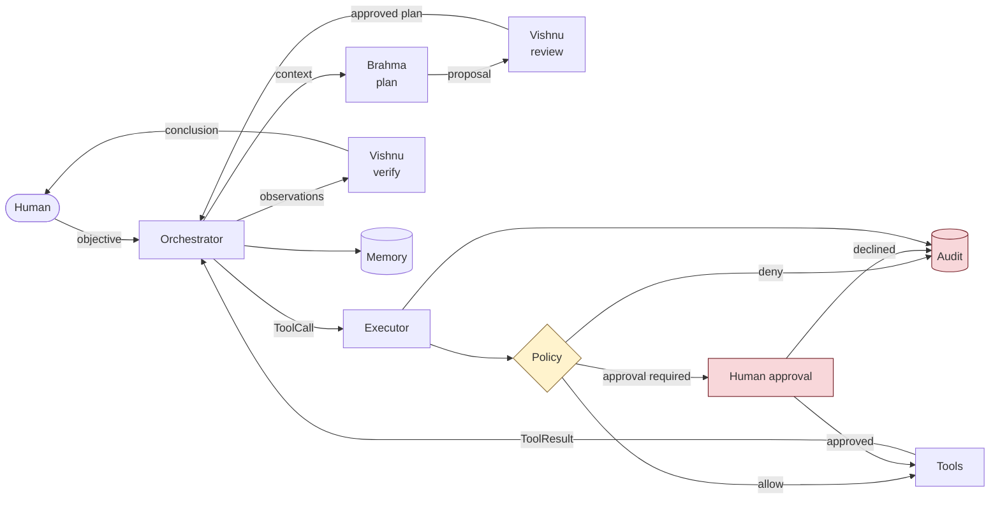

# Scrappy OS

**An AI-native control plane for a Linux machine.**

Linux is the body. Scrappy OS is the layer above it that perceives machine
state, plans, invokes *typed* tools under an explicit permission system,
verifies what happened, and records all of it.

```
  You:      scrappy ask "Inspect disk usage and tell me what filesystem is most full"

  Scrappy:  plan     -> read filesystem usage, identify the host
            review   -> both steps are read-only; approved
            execute  -> system.disk [READ] ok 0ms
                        system.info [READ] ok 3ms
            verify   -> objective satisfied
            answer   -> /opt/claude-code is at 92.3% used (307.6MiB of 340.0MiB).
                        The root filesystem has 29.8GiB free.
            audit    -> 13 events recorded for task 08326a05
```

Status: **v0.1**. Single node, single machine, diagnostic-first. See
[Roadmap](docs/ROADMAP.md).

---

## What Scrappy OS is

- A **control plane**: reasoning, planning and orchestration above the kernel.
- A **typed tool layer**: every machine capability is a schema-validated
  operation with a declared risk level, not a string handed to a shell.
- A **permission system**: policy, approvals and audit are load-bearing
  architecture, not middleware bolted on later.
- **Provider-neutral**: OpenAI-compatible APIs and local Ollama models sit
  behind one interface. Nothing above that layer knows which is in use.

## What Scrappy OS is not

- **Not a kernel or a Linux distribution.** It runs *on* Linux, as a normal
  unprivileged process.
- **Not an autonomous agent.** The heartbeat is a liveness signal, not
  permission to invent work. Tasks start when a human states an objective.
- **Not a shell wrapper.** `shell.run` exists as a deliberate escape hatch,
  behind an allowlist, a denylist, a risk classifier and an approval gate.
- **Not root.** It cannot restart a service or install a package on its own.
  Granting it that is an explicit, documented decision - see
  [deploy/README.md](deploy/README.md).
- **Not multi-machine, not a browser, not voice.** Those are later versions,
  built on this foundation rather than mixed into it.

---

## Architecture

Named after what each part does:

| Organ | Package | Responsibility |
|---|---|---|
| **Brain** | `brain/` | Orchestration loop, execution budgets |
| **Brahma** | `agents/brahma.py` | Understands the objective, proposes a plan |
| **Vishnu** | `agents/vishnu.py` | Reviews plans, verifies outcomes, judges completion |
| **Mahesh** | `agents/mahesh.py` | Rollback, cleanup, diagnosis of failure |
| **Heart** | `heart/` | Lifecycle, supervision, health |
| **Breath** | `breath/` | Periodic heartbeat |
| **Stomach** | `memory/` | Working, episodic and semantic memory |
| **Face** | `interface/` | CLI and local HTTP API |
| **Hands** | `tools/` | Typed machine capabilities |
| **Immune system** | `security/` | Paths, risk, policy, approvals, audit |



The important structural property: **agents cannot execute anything.** They
return typed data. The orchestrator turns that data into a `ToolCall`, and the
executor is the only code path that reaches a tool - after asking the policy
engine. Prompt injection against an agent produces *a request*, and a request
still has to survive schema validation, the risk ceiling, the policy engine and,
above WRITE, a human.

Full detail: [docs/ARCHITECTURE.md](docs/ARCHITECTURE.md).

---

## Installation

Requires **Linux** and **Python 3.12+**.

```bash
git clone https://github.com/getkcoin-alt/-scrappy-os
cd -scrappy-os
./scripts/bootstrap.sh --with-tests
source .venv/bin/activate
```

The bootstrap script creates a virtualenv, installs the package, creates the
data directory and runs `scrappy doctor`. It does not install system packages
or touch anything outside the repository and the data directory.

### Your first task

Scrappy OS boots with a deterministic **development provider** - no API key, no
network, no GPU. It is a rule table, not a model, and every interface says so.
It exists so you can watch the control plane work before pointing it at an LLM.

```bash
scrappy ask "Inspect disk usage and tell me what filesystem is most full"
scrappy audit
```

### Connecting a real model

```bash
# Local, via Ollama
export SCRAPPY_MODEL_PROVIDER=ollama
export SCRAPPY_MODEL=llama3.1
export OLLAMA_BASE_URL=http://127.0.0.1:11434

# Or any OpenAI-compatible endpoint
export SCRAPPY_MODEL_PROVIDER=openai
export SCRAPPY_MODEL=gpt-4o-mini
export OPENAI_API_KEY=sk-...

scrappy doctor    # confirms connectivity before you rely on it
```

---

## Configuration

Precedence, highest first: constructor arguments, environment, `.env`, YAML,
defaults. See [`.env.example`](.env.example) and
[`config/scrappy.example.yaml`](config/scrappy.example.yaml).

The settings that matter most:

| Setting | Default | Why it matters |
|---|---|---|
| `SCRAPPY_WORKSPACE` | `~/.local/share/scrappy-os/workspace` | The only directory tools may write to |
| `SCRAPPY_ALLOWED_READ_ROOTS` | `/etc,/proc,/sys,/var/log,/usr/share` | Everything outside is unreadable |
| `SCRAPPY_MAX_PLAN_STEPS` | `12` | Bounds one task's blast radius |
| `SCRAPPY_MAX_TASK_SECONDS` | `300` | Bounds wall-clock runaway |
| `SCRAPPY_SHELL_ALLOWLIST` | *(see `.env.example`)* | Empty disables `shell.run` entirely |
| `SCRAPPY_SHELL_DENYLIST` | `rm,dd,mkfs,shutdown,…` | Never runnable, even with approval |
| `SCRAPPY_ALLOW_APPROVALS` | `true` | `false` denies privileged work outright |
| `SCRAPPY_API_HOST` | `127.0.0.1` | The API has no authentication |

`scrappy config show` prints the effective configuration. Secrets appear as
`<set>` / `<unset>` and are never written to logs or the audit database.

---

## Commands

```
scrappy ask "objective"     Give Scrappy OS an objective (read-only by default)
  --max-risk LEVEL            read | write | privileged | destructive
  --dry-run                   describe mutating steps instead of running them
  --yes                       pre-approve PRIVILEGED steps (never DESTRUCTIVE)
  --json                      machine-readable output

scrappy status              Runtime state, component health, pending approvals
scrappy doctor              Pre-flight check with PASS/WARN/FAIL and remedies
scrappy audit [TASK_ID]     The audit trail, or one task's full trace
scrappy approvals           Approval requests waiting for a human
scrappy approve ID          Resolve one (--deny to refuse)
scrappy tools               Registered tools and their risk classifications
scrappy config show         Effective configuration, secrets redacted
scrappy serve               Run the local API on 127.0.0.1:8787
```

## API

Local-only by default, and **unauthenticated** - see
[deploy/README.md](deploy/README.md) before exposing it.

```
GET  /health                  Liveness and component health
GET  /status                  Full runtime state
POST /tasks                   Submit an objective (202 Accepted)
GET  /tasks/{id}              Result or progress
GET  /tasks/{id}/events       Server-sent event stream
GET  /approvals               Pending approval requests
POST /approvals/{id}          Approve or deny exactly one operation
GET  /audit                   Audit events, optionally filtered by task
```

The API has no interactive approver by design. A task needing approval parks
until a human resolves it through `POST /approvals/{id}` or `scrappy approve`.
The HTTP layer cannot approve on its own.

---

## Security model

Four risk levels, and what happens at each:

| Level | Examples | Default policy |
|---|---|---|
| **READ** | read a file, disk usage, process list, `git status` | allow |
| **WRITE** | create or modify files inside the workspace | allow in workspace; approval outside |
| **PRIVILEGED** | `systemctl restart`, package install, network config | **approval required** |
| **DESTRUCTIVE** | deletion outside the workspace, `mkfs`, shutdown, `rm -rf` | **approval + typed confirmation** |

Anything unrecognised is denied. An unknown tool name, an unmatched risk level,
an argument the schema does not permit - all fail closed.

An approval authorises **one operation, once**: this tool, these arguments,
this task, before this deadline. Approvals are single-use and enforced at the
point of execution, not by convention.

```
  Approval required
  Task:    Repair nginx
  Action:  run: systemctl restart nginx
  Risk:    PRIVILEGED
  Reason:  systemctl restart changes system state
  Expires: 2026-08-16T04:15:00+00:00
  Approve? [y/N]
```

More: [docs/SECURITY.md](docs/SECURITY.md) ·
[docs/THREAT_MODEL.md](docs/THREAT_MODEL.md)

### Known limitations in v0.1

Stated plainly, because a security model you cannot see the edges of is not one:

- **The API is unauthenticated.** Loopback binding and a proxy are the answer.
- **Semantic memory is an interface only.** `NullSemanticMemory` stores nothing
  and reports `available = False`.
- **Rollback is best-effort.** `fs.write` keeps a `.scrappy-bak` copy; `shell.run`
  and `process.kill` declare honestly that they cannot be undone.
- **Approval is per-operation, not per-plan.** A ten-step privileged plan asks
  ten times. That is deliberate for v0.1, and will be noisy.
- **A model can still be wrong inside its permissions.** Nothing here prevents
  a well-formed, correctly-authorised, unhelpful action. The controls bound
  *blast radius*, not correctness.

---

## Development

```bash
make install      # venv + dev extras
make lint         # ruff
make typecheck    # mypy --strict
make test         # full suite
make security-test
make check        # lint + test: the v0.1 gate
```

The test suite is organised by what it protects:

- `tests/security/` - path traversal, symlink escape, shell isolation, SSRF,
  secret redaction, approval semantics. These are the tests that matter most.
- `tests/unit/` - models, event bus, policy, registry, routing, budgets.
- `tests/integration/` - the full objective→plan→execute→verify→audit cycle
  and the local API.

Adding a tool safely: [docs/TOOL_PROTOCOL.md](docs/TOOL_PROTOCOL.md).
Agent responsibilities: [docs/AGENT_PROTOCOL.md](docs/AGENT_PROTOCOL.md).

---

## Roadmap

| Version | Scope |
|---|---|
| **v0.1** | Single-node Linux control plane. Diagnose, explain, refuse. |
| v0.2 | Browser automation, richer system tools, mutating git |
| v0.3 | Voice and vision interfaces |
| v0.4 | Remote Scrappy nodes |
| v0.5 | VM and container operator layer |
| v1.0 | Stable AI-native machine operating environment |

Windows and macOS arrive through explicit adapters or virtualisation, not by
diluting the Linux core. Detail: [docs/ROADMAP.md](docs/ROADMAP.md).

## License

Apache-2.0.
