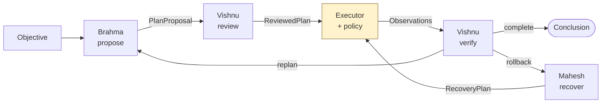

# Agent protocol

Three reasoning roles: Brahma creates, Vishnu preserves, Mahesh dissolves.

## What an agent is - and is not

An agent is a role, a prompt, and a schema it must produce.

It has **no privileges**. It cannot call a tool, read a file, or change the
machine. It holds no executor, no registry write access and no filesystem
handle. Its entire output is a validated Pydantic object handed back to the
orchestrator, which decides what to do about it.

That separation is the point of the whole design. Prompt injection against an
agent yields *a request*, and a request still has to survive schema validation,
the risk ceiling, the policy engine and - above WRITE - a human.



Note that Mahesh's output goes through the *same* executor. There is no
recovery bypass.

---

## Brahma — creation

**Proposes. Never executes.**

| | |
|---|---|
| Input | Objective, risk ceiling, tool catalogue filtered to that ceiling, observations so far, feedback from a previous rejection |
| Output | `PlanProposal` |
| Prompt | [`prompts/brahma.md`](../prompts/brahma.md) |

```python
class PlanProposal(ScrappyModel):
    reasoning: str
    steps: list[ProposedStep]
    required_capabilities: list[str]
    predicted_side_effects: list[str]
```

Responsibilities:

1. **Understand the objective** - what would actually satisfy it.
2. **Inspect before changing.** Diagnose with read-only tools first. If reading
   alone answers the question, propose only reads.
3. **Identify required capabilities** from the catalogue. Never invent a tool;
   `ProposedStep` rejects anything that is not a plain identifier.
4. **Predict side effects** for anything that changes the machine.
5. **Set `expected_risk` honestly.** Under-declaring does not get a step past
   the policy engine - the tool's own classifier is authoritative at execution
   time, and a mismatch is logged. It only makes the plan harder to review.
6. **Give each step a `success_criteria`** - a plan that cannot say what it
   expects cannot be verified afterwards.
7. **Give a `rollback_hint`** for anything not trivially reversible.

The catalogue Brahma sees is already filtered by the objective's risk ceiling,
so an agent working under READ is not shown tools it could never be permitted
to run. Short plans are better: three well-chosen steps beat ten speculative
ones, and every step spends budget.

---

## Vishnu — preservation

**Reviews plans. Verifies outcomes. Judges completion.**

Vishnu runs twice per cycle, doing two different jobs.

### `review(task, plan, memory) -> ReviewedPlan`

Before anything happens. Looks for:

- steps that do not serve the objective, or duplicate what is already observed
- assumptions the observations do not support
- steps in an order that cannot work (acting before diagnosing)
- risk understated for what the arguments actually do
- mutations proposed before the cause is established

```python
class ReviewedPlan(ScrappyModel):
    approved: bool
    reasoning: str
    concerns: list[str]
    steps: list[ProposedStep]   # the plan Vishnu is WILLING TO RUN
```

`steps` is the corrected plan, not a critique of the original. Vishnu may drop
steps or reorder them. Rejection (`approved=False`) sends the task back to
Brahma with the reasoning attached, and costs a replan from the budget.

**Removing a step is the only power Vishnu has** - and that is the direction of
power that is safe to grant. A review that approves everything is a review that
is not happening.

### `verify(task, memory) -> Verification`

After steps have run.

```python
class Verification(ScrappyModel):
    objective_satisfied: bool
    decision: "continue" | "replan" | "complete" | "rollback" | "abort"
    confidence: float
    reasoning: str
    conclusion: str        # what the human actually reads
    concerns: list[str]
```

| Decision | Means | Orchestrator does |
|---|---|---|
| `complete` | Objective satisfied | Finish, return `conclusion` |
| `continue` | More of the current plan is needed | Another cycle (costs a replan) |
| `replan` | The approach was wrong | Another cycle with feedback |
| `rollback` | Something changed and should be undone | Hand to Mahesh |
| `abort` | Cannot be satisfied | Fail, with `conclusion` as the explanation |

The conclusion must come from the observations. If they are insufficient, say
so and ask for more steps rather than inferring - never state as fact something
no tool reported, and never claim to have changed anything.

---

## Mahesh — dissolution

**Rollback, cleanup, diagnosis of unrecoverable failure.**

| | |
|---|---|
| Input | Objective, observations, failure reason, steps that ran |
| Output | `RecoveryPlan` |
| Prompt | [`prompts/mahesh.md`](../prompts/mahesh.md) |

```python
class RecoveryPlan(ScrappyModel):
    diagnosis: str
    recoverable: bool
    reasoning: str
    steps: list[ProposedStep]
```

Responsibilities:

1. **Diagnose first.** Say what happened and what changed, from observations.
2. **Only undo what was actually done.** Do not "clean up" state with no
   evidence it was created.
3. **Prefer the narrowest recovery.** Restoring one file beats resetting a
   service; resetting a service beats rebooting a machine.
4. **Never delete or overwrite** anything not observed being created by this task.
5. **Say when it cannot be fixed.** `recoverable=False` with a diagnosis a human
   can act on is a good outcome, not a failure.

### Mahesh has no special authority

Worth stating twice, because it is the obvious place to be tempted into a
bypass - the system is already broken, surely the cleanup should be allowed to
run?

No. Recovery steps go through the same executor, the same policy engine and the
same approval gate, with the task's *original* risk ceiling. A compromised or
confused agent that can trigger a failure would otherwise have a path to
unrestricted execution by way of the recovery handler.

What Mahesh may always do freely is *diagnose*. It can explain what happened and
what a human should do even when it cannot act.

---

## The shapes agents may emit

All in `agents/schemas.py`, all inheriting `ScrappyModel` with
`extra="forbid"`. A model that invents `{"sudo": true}` fails validation rather
than having its invention quietly ignored - and a failed validation is visible,
not silent.

```python
class ProposedStep(ScrappyModel):
    intent: str                        # why this step exists
    tool: str                          # registered tool name, validated as an identifier
    arguments: dict[str, Any]
    expected_risk: RiskLevel
    expected_side_effects: list[str]
    success_criteria: str | None
    rollback_hint: str | None
```

Nothing here grants authority. A validated `ProposedStep` is still just a
request.

---

## Customising behaviour

Edit `prompts/brahma.md`, `prompts/vishnu.md` or `prompts/mahesh.md`. Prompts
are looked up in `$SCRAPPY_PROMPT_DIR`, then the repository's `prompts/`, then
`./prompts`. A missing or unreadable file falls back to the built-in default in
the agent module rather than failing a boot.

Prompts shape what an agent *asks for*. They cannot widen what it is permitted
to do - that is configuration and policy, not text.

## Adding a fourth role

If you need one, the pattern is:

1. Add a member to `AgentRole`.
2. Add a schema to `agents/schemas.py` for what it may emit.
3. Subclass `Agent`, implement `system_prompt()`, add a method returning that
   schema.
4. Wire it into the orchestrator at the point it should run.
5. Add a rule to `MockProvider.generate_structured` so the offline path and the
   tests still work.

The role gets no execution capability. If it needs to act, it proposes steps
and the orchestrator runs them through the executor - like every other role.
